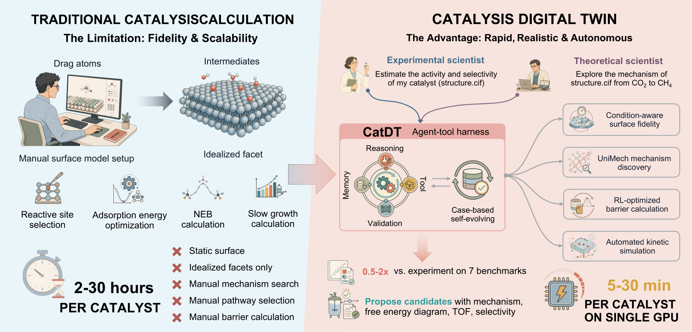
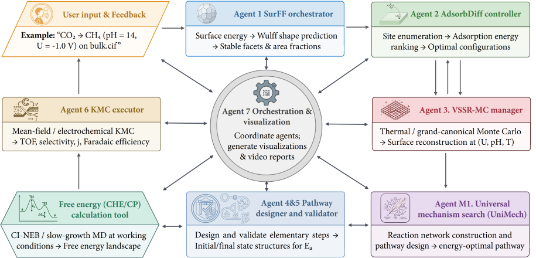
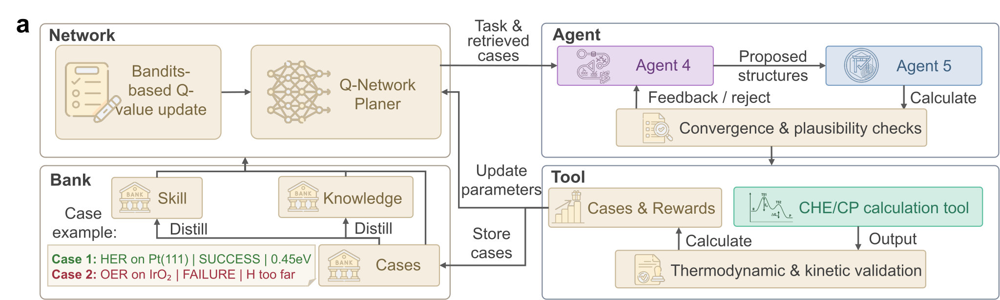

# CatDT - Catalysis Digital Twin

**A self-evolving multi-agent system (MAS) for autonomous heterogeneous catalysis**

<p align="center">
  
  
</p>

<p align="center">
  
  
</p>

---

## Overview

> **TL;DR:** CatDT is a CAMEL-based **multi-agent** catalytic digital twin.
> Input: **one bulk structure + one natural-language reaction description**.
> Output: **reconstructed surfaces, validated NEB endpoints, activation barriers, microkinetic rates, and a reproducible report** — all orchestrated by LLM agents calling deterministic scientific tools.

CatDT is an autonomous digital-twin pipeline for heterogeneous catalysis: from a bulk crystal and a natural-language reaction description it predicts surfaces, reconstruction, mechanisms, and transition-state barriers (NEB/UMA or slow-growth MD), and closes the loop with CatMAP microkinetics.

```python
from camel_agents.workflow import CatDTCamelWorkflow

wf = CatDTCamelWorkflow()
result = wf.run({
    "bulk_structure_path": "POSCAR_Cu",
    "reaction_description": "CO hydrogenation to CH4 on Cu",
    "mc_temperature_k": 500.0,
    "calculate_barriers": True,
})
```

The architecture principle is strict:
- **Agent** does reasoning and coordination (LLM)
- **Tool** does deterministic scientific execution (Python)
- **Scientific programs** in `core/*` and `deps/*` are exposed as CAMEL `FunctionTool` instances

---

## Use CatDT with AI Coding Agents (Skill)

> **Don't want to run the full multi-agent pipeline?** CatDT's 15+ modules (SurFF, AdsorbDiff, VSSR-MC, NEB, UniMech, CatMAP, ...) are all usable standalone — but knowing the right import paths, parameters, and module chains requires deep codebase familiarity.

The **[`skill/`](skill/)** directory contains a ready-to-use **AI coding agent skill** that solves this. Install it in any skill-compatible coding agent (Claude Code, Codex, OpenCode, etc.) and the agent can:

- **Intelligently route** any catalysis request — "compute the CO adsorption energy on Cu(111)" or "find NEB barrier for *CO→*CHO" — to the correct module(s)
- **Auto-configure parameters** from natural language (element → bulk structure, adsorbate auto-prefixing, default T/model selection)
- **Chain modules** for partial pipelines without running the full multi-agent workflow
- **Generate runnable scripts** from 9 ready-to-adapt templates covering every module
- **Enforce auto-visualization** — every computation produces structure PNGs, trajectory GIFs, and energy diagrams

**Quick install (Claude Code):**
```bash
# The skill/ directory is already in the repo — just clone and use
git clone https://github.com/AI4QC/catdt.git
cd catdt
# Set CATDT_ROOT so the skill templates can find dependencies
export CATDT_ROOT=$(pwd)
```

The skill is in `skill/` (not `.claude/skills/`) so it works with any agent. Copy it to your agent's skill directory if needed.

See [`skill/SKILL.md`](skill/SKILL.md) for the full routing table, intent catalog, and module API reference.

---

## Table of Contents

- [Use CatDT with AI Coding Agents (Skill)](#use-catdt-with-ai-coding-agents-skill)
- [Motivation: Beyond Adsorption Energies](#motivation-beyond-adsorption-energies)
- [Digital Twin Workflow](#digital-twin-workflow)
- [8-Agent Multi-Agent System](#8-agent-multi-agent-system)
  - [Agent 1 — SurFF Surface Initializer](#agent-1--surff-surface-initializer)
  - [Agent 2 — VSSR-MC Reconstruction Manager](#agent-2--vssr-mc-reconstruction-manager)
  - [Agent 3 — AdsorbDiff Adsorption Controller](#agent-3--adsorbdiff-adsorption-controller)
  - [Agent M1 — UniMech Mechanism Search Coordinator](#agent-m1--unimech-mechanism-search-coordinator)
  - [Agent 4 — Pathway & Endpoint Designer](#agent-4--pathway--endpoint-designer)
  - [Agent 5 — Validation Auditor (Hard Gate)](#agent-5--validation-auditor-hard-gate)
  - [Agent 6 — KMC Executor](#agent-6--kmc-executor)
  - [Agent 7 — Orchestration & Visualization](#agent-7--orchestration--visualization)
  - [Free Energy Tools (Not Agents)](#free-energy-tools-not-agents)
- [Agent-Tool Architecture: How It Actually Works](#agent-tool-architecture-how-it-actually-works)
  - [Tool Registry Facade](#tool-registry-facade)
  - [28 CAMEL FunctionTools](#28-camel-functiontools)
  - [Tool Implementation Layers](#tool-implementation-layers)
  - [Agent4/5 Iterative Design-Validation Cycle](#agent45-iterative-design-validation-cycle)
- [Memento Reinforcement Loop](#memento-reinforcement-loop)
  - [Why Memento Is Needed](#why-memento-is-needed)
  - [State / Action / Reward Design](#state--action--reward-design)
  - [Read-Act-Evaluate-Write Loop](#read-act-evaluate-write-loop)
  - [Casebank Format and Retrieval Algorithm](#casebank-format-and-retrieval-algorithm)
  - [Evolvable Policy (Bandit Strategy)](#evolvable-policy-bandit-strategy)
  - [Cross-Reaction Generalization](#cross-reaction-generalization)
- [Scientific Backends (core/ and deps/)](#scientific-backends-core-and-deps)
- [Project Structure](#project-structure)
- [Installation](#installation)
- [Quick Start](#quick-start)
- [Testing & Validation](#testing--validation)
- [FAQ](#frequently-asked-questions)
- [References](#references)
- [Citation](#citation)
- [License](#license)

---

## Motivation: Beyond Adsorption Energies

<p align="center">
  
</p>

### The Core Scientific Problem

Most computational catalysis studies optimize adsorption energies on preselected static structures. But under real operating conditions, the catalyst surface itself is dynamic:

- facets redistribute under temperature and pressure,
- adsorbate coverage shifts and cooperative effects emerge,
- surface composition can reconstruct entirely.

**If the structure is wrong, barriers and kinetics computed on it are wrong.**

### Why Existing Workflows Break

| Common Assumption | Real Operating Behavior |
|---|---|
| Clean static slab | Dynamic reconstructed surface under T, P |
| Single low-index facet | Multi-facet, condition-dependent exposure |
| Fixed adsorbate sites | Nontrivial site switching / cooperative effects |
| One handcrafted mechanism | Competing pathways with different selectivity |
| Manual NEB endpoint construction | Brittle, error-prone, not scalable |

### CatDT Design Objective

CatDT makes this pipeline executable end-to-end:

1. **Generate realistic exposed surfaces** from bulk crystal (SurFF Wulff prediction)
2. **Reconstruct surfaces** under operating conditions (VSSR-MC at temperature)
3. **Place adsorbates** with ML-guided conditional sampling (AdsorbDiff)
4. **Design and validate NEB endpoints** with LLM reasoning + deterministic geometry checks
5. **Compute barriers** with two-phase CI-NEB on the UMA force field (or slow-growth MD)
6. **Run microkinetics** (CatMAP) for TOF, selectivity, and sensitivity analysis
7. **Accumulate experience** from success/failure histories (Memento casebank)

This motivates a **tool-centric multi-agent architecture**, not pure prompt chaining.

---

## Digital Twin Workflow

CatDT is a **single unified digital twin** of a working catalyst. An 8-agent orchestration drives the full pipeline; deterministic scientific tools do the computation.

<p align="center">
  
</p>

### Unified Execution Flow

```
Bulk Crystal (user input: POSCAR) + Reaction Description (natural language)
    │
    ├─ Agent 1: SurFF surface prediction → Wulff shape, ranked facets + slabs
    │
    ├─ Agent 2a: VSSR-MC clean-slab reconstruction (MC at temperature T, CHGNet / UMA)
    │
    ├─ Agent 3: AdsorbDiff adsorption on reconstructed surface
    │
    ├─ Agent 2b: VSSR-MC reconstruction with adsorbate present
    │
    ├─ [Optional] Agent M1: UniMech mechanism search → competing pathways
    │
    ├─ Agent 4/5: iterative NEB endpoint design + validation (max 10 rounds)
    │     Tool-computed baseline → LLM designs → programmatic gate → Memento learning
    │
    ├─ Barrier computation (deterministic tool, not agent)
    │     UMA two-phase CI-NEB, or slow-growth MD (CP-MACE) → Ea_fwd, Ea_rev, E_rxn
    │
    ├─ Agent 6: CatMAP microkinetics → TOF, selectivity, coverage
    │
    └─ Agent 7: Orchestration, visualization, final report
```

---

## 8-Agent Multi-Agent System

CatDT has **8 agents** defined in `camel_agents/prompts.py`. Agent 1–7 handle the main simulation pipeline; Agent M1 handles reaction mechanism search (activated when `enable_mechanism_search=True`). All scientific computation happens through **tools** — agents only do reasoning and coordination.

```
┌────────────────────────────────────────────────────────────────────┐
│                    CAMEL Multi-Agent Orchestration                  │
│                    (camel_agents/workflow.py)                       │
├────────────────────────────────────────────────────────────────────┤
│                                                                    │
│  Agent 1  ─── generate_surfaces ─────────────► SurFF               │
│  Agent 2a ─── reconstruct clean slab ────────► VSSR-MC (CHGNet/UMA)│
│  Agent 3  ─── adsorb on reconstructed surface► AdsorbDiff          │
│  Agent 2b ─── reconstruct with adsorbate ────► VSSR-MC (CHGNet/UMA)│
│                                                                    │
│  Agent 4 ◄──────── feedback ────────► Agent 5                      │
│    │  LLM pathway design                │  LLM + programmatic      │
│    │  + Memento retrieval               │  validation gate          │
│    │  Tools:                            │  Tools:                   │
│    │   build_steps_payload              │   programmatic_validation │
│    │   retrieve_agent45_memento_cases   │   run_agent45_energy_gate │
│    │   record_agent45_memento_case      │   record_agent45_memento  │
│    └──────────── iterative loop (max 10) ──────┘                   │
│                        │ PASS                                      │
│                        ▼                                           │
│  ┌─ Free Energy Tools (NOT agents) ────────────────────────────┐  │
│  │  run_neb_for_steps ──────────────────► BarrierPredictor      │  │
│  │  compute_adsorption_energies ────────► FairchemPredictor     │  │
│  │  (NEB + UMA, or slow-growth MD + CP-MACE)                   │  │
│  │  If Ea > threshold → Feedback to Agent 5                     │  │
│  └──────────────────────────────────────────────────────────────┘  │
│                        │                                           │
│                        ▼                                           │
│  Agent 6 ─── run_kmc_simulation ─────────────► CatMAP              │
│             (KMC only: TOF, selectivity, rate-limiting step)       │
│                                                                    │
│  Agent 7 ─── Orchestration & Visualization ──► Coordinate agents   │
│          ─── generate_final_report ──────────► Viz + report        │
│                                                                    │
└────────────────────────────────────────────────────────────────────┘
```

### Agent 1 — SurFF Surface Initializer

**Role:** Catalyst Surface Initializer
**Scientific problem:** Which facets are actually exposed under operating conditions?
**Tool:** `generate_surfaces` → `core/surface/surff_predictor.py`

```python
# What Agent 1 does internally (via tool call):
from core.surface.surff_predictor import SurFFPredictor

predictor = SurFFPredictor(surff_root="deps/SurFF")
result = predictor.predict(structure="POSCAR_Cu", top_n=3)
# Returns: Wulff shape + ranked facets with surface energies
# e.g. (111): 45.2% area, E_surf = 0.082 eV/A^2
#      (100): 32.1% area, E_surf = 0.095 eV/A^2
```

**What happens:** Generates all Miller-index slabs up to max_index=2, runs ML relaxation (EquiformerV2), computes Wulff shape, selects top-N most exposed surfaces.

**Output:** `slab_111.vasp` — the simulation-ready catalyst surface.

**Failure mode handled:** Unrealistic facet ranking or missing dominant exposed planes.

### Agent 2 — VSSR-MC Reconstruction Manager

**Role:** Surface Reconstruction Sampler (two-step: 2a clean → 2b with adsorbate)
**Scientific problem:** Operating surfaces are dynamic, not static slabs. The catalyst surface reconstructs under operating conditions, and adsorbates further modify the reconstructed surface. A two-step process captures both effects: first reconstruct the clean surface, then adsorb, then reconstruct again with the adsorbate present.
**Tool:** `simulate_surface_reconstruction` → `core/reconstruction/vssr_mc_predictor.py`
**Energy models:** CHGNet (NFF framework, default) or UMA (FairChem framework), configurable via `mc_energy_model`

```python
from core.reconstruction.vssr_mc_predictor import VSSRMCPredictor

# Reconstruction with CHGNet:
predictor = VSSRMCPredictor(model_type="CHGNetNFF")
# Step 2a: reconstruct clean slab
result_2a = predictor.sample(
    surface=clean_slab,
    adsorbates=["Cu"],
    temperature=500.0,       # K
    total_sweeps=50,
)
# Step 3: place adsorbate on reconstructed surface (Agent 3)
# Step 2b: reconstruct with adsorbate, using external indices
result_2b = predictor.sample(
    surface=slab_with_adsorbate,
    adsorbates=["Cu"],
    temperature=500.0,
    total_sweeps=100,
    surface_indices=top_layer_cu_indices,    # correctly identify metal surface
    adsorbate_indices=co_atom_indices,       # keep adsorbate free but not "surface"
)

# Reconstruction with UMA:
predictor_uma = VSSRMCPredictor(model_type="UMA")
# Same two-step flow, UMA provides energy/forces via FAIRChemCalculator
```

**Two-step reconstruction flow:**
1. **Step 2a** (clean): Reconstruct the bare surface under operating conditions. No adsorbate → z-coordinate layer detection works correctly. Surface forms realistic defects (steps, kinks, adatoms).
2. **Step 3** (adsorb): AdsorbDiff places adsorbates on the reconstructed surface (more realistic adsorption sites than on idealized clean slab).
3. **Step 2b** (with adsorbate): Reconstruct again with adsorbate present. External `surface_indices` and `adsorbate_indices` ensure correct constraint handling — metal atoms free for MC, adsorbate atoms free but not misidentified as "surface layer".

**What happens:** Semi-grand-canonical MC explores compositional/configurational space. Each sweep proposes atom addition/removal/swap, accepted by the Metropolis criterion based on surface excess energy at the operating temperature.

**Energy model selection:**

| Mode | CHGNet | UMA |
|------|--------|-----|
| Surface MC | `EnsembleNFFSurface` | `UMASurfaceCalculator` |

**Output:** `lowest_energy_reconstructed_structure.vasp` + MC trajectory GIF + energy/acceptance history. Both `surface_energy` (excess) and `total_energy` (absolute, from ML model) are recorded.

**Failure mode handled:** MC trajectory stagnation or physically implausible reconstruction candidates.

### Agent 3 — AdsorbDiff Adsorption Controller

**Role:** Adsorption Site Planner (runs between Agent 2a and 2b)
**Scientific problem:** High-symmetry placement misses realistic adsorption minima. Agent 3 operates on the **already-reconstructed surface** from Agent 2a, so adsorption sites reflect the true operating surface topology (steps, kinks, adatoms) rather than idealized low-index planes.
**Tool:** `predict_adsorption_sites` → `core/reconstruction/adsorbdiff_predictor.py`

```python
# What Agent 3 does internally (via tool call):
from core.reconstruction.adsorbdiff_predictor import AdsorbDiffPredictor

predictor = AdsorbDiffPredictor(adsorbdiff_root="deps/AdsorbDiff")
result = predictor.predict(
    surface=reconstructed_surface,  # from Agent 2a, not the pristine slab
    adsorbate="*CO",       # Must use * prefix for AdsorbDiff DB
    num_sites=5,
)
# Returns: ranked adsorption configurations sorted by energy
# best_result.final_structure → reconstructed Cu(111) with CO at optimal site
```

**What happens:** Creates N random initial placements, runs denoising diffusion sampling (100 steps), relaxes each with BFGS (fmax=0.05), selects lowest-energy configuration.

**Output:** `best_adsorption_config.vasp` — reconstructed surface with initial adsorbate placed.

**Failure mode handled:** Low-diversity adsorption set that misses stable non-symmetric configurations.

### Agent M1 — UniMech Mechanism Search Coordinator

**Role:** Mechanism Search Coordinator (activated when `enable_mechanism_search=True`)
**Scientific problem:** Manual pathway design assumes a single "obvious" mechanism. Most catalytic reactions have **competing pathways** with different selectivities (e.g., CO hydrogenation: direct dissociation vs. H-assisted vs. formyl pathway). Agent M1 discovers these automatically.
**Tools:** `initialize_mechanism_context`, `generate_candidate_steps`, `run_mechanism_search`, `extract_pathway_shortlist`

Agent M1 sits between Agent 2 (surface reconstruction) and Agent 4/5 (NEB endpoint design). It systematically explores the reaction network and hands a shortlist of promising pathways to Agent 4/5 for barrier calculation.

**Three exploration modes:**

| Mode | Method | Best For |
|---|---|---|
| `agent_guided` | LLM recommends 3+ pathways → UMA evaluation | Well-known reactions, quick screening |
| `systematic` | BFS via RDKit bond operations → LLM filter → UMA eval | Novel reactions, comprehensive coverage |
| `both_sequential` | Agent-guided first, then systematic for uncovered branches | Production use |

**How it works:**

```
Reconstructed surface (from Agent 2) + reaction description
    ↓
CandidateGeneratorRouter
    └─ RDKit Bond Operations (element-agnostic)
       Operations: dissociation, hydrogenation, association,
                   Eley-Rideal, isomerization, desorption
    ↓
MechanismSearchEngine (beam search + sibling pruning)
    ├─ Expand frontier nodes → generate children
    ├─ Evaluate via FreeEnergyRouter (UMA)
    ├─ Prune: delta_keep=0.10 eV (keep siblings), delta_prune=0.30 eV (remove)
    └─ Stop: max_depth=8, max_evaluations=40
    ↓
Ranked pathways → Agent 4/5 handoff
```

**Configuration:**

```python
CatDTConfig(
    enable_mechanism_search=True,
    mechanism_exploration_mode="agent_guided",  # systematic, both_sequential, both_parallel
    mechanism_max_depth=8,
    mechanism_beam_width=8,
    mechanism_delta_keep=0.10,   # eV
    mechanism_delta_prune=0.30,  # eV
    mechanism_max_state_evaluations=40,
)
```

**Key files:** `core/pathway/search_engine.py` (MechanismSearchEngine), `core/pathway/candidate_generators.py` (SystematicCRNExplorer), `camel_agents/tooling/mechanism.py` (MechanismToolsMixin)

**Failure mode handled:** Search space explosion (controlled by beam width + evaluation budget) or no path found to target state.

### Agent 4 — Pathway & Endpoint Designer

**Role:** Reaction Pathway Designer (LLM-driven)
**Scientific problem:** Manual endpoint construction is brittle, expensive, and doesn't scale.
**Tools:** `build_steps_payload`, `retrieve_agent45_memento_cases`, `record_agent45_memento_case`
**Timeout:** 1800s (30 min) — longer than other agents due to iterative reasoning.
**Memory:** `ChatHistoryMemory` with 12KB token limit and 12-message sliding window.

Agent 4 receives:
1. **Reaction context** parsed from natural language (reaction_type, intermediates, constraints)
2. **Tool-computed baseline steps** — initial/final Atoms structures with adsorbate coordinates for each elementary step
3. **Staging plan** — programmatically computed hollow/bridge site positions for atoms entering/leaving the surface
4. **Memento cases** — retrieved similar historical successes and failures
5. **Agent 5 feedback** from previous iteration (if any)

Agent 4 outputs a `PathwayDesign` JSON:

```json
{
  "pathway_name": "CO_hydrogenation_to_CH4",
  "description": "7-step hydrogenation pathway on Cu(111)",
  "overall_reaction": "CO* + 4H -> CH4(g)",
  "steps": [
    {
      "step_name": "*CO -> *CHO",
      "reactant_formula": "CO",
      "product_formula": "CHO",
      "reaction_type": "hydrogenation",
      "atoms_to_add": [
        {"species": "H", "position": [4.52, 3.18, 12.85], "reason": "H near C for C-H bond"}
      ],
      "atoms_to_modify": [],
      "atoms_to_remove": [],
      "confidence": 0.85
    }
  ]
}
```

**Hard constraints enforced by prompt:**
- Tool-stage coordinates are read-only (cannot rewrite existing atom positions)
- Only `atoms_to_add` allowed; `atoms_to_modify` and `atoms_to_remove` must be empty
- Each step must have same element multiset on both sides (NEB-compatible)
- Prompts are reaction-agnostic (no reaction-specific hardcoding)
- Output must be valid JSON only (no markdown, no analysis text)

**Prompt language:** Chinese (see `camel_agents/prompts.py:TaskPrompts.pathway_design`)

### Agent 5 — Validation Auditor (Hard Gate)

**Role:** Pathway Validation Auditor (LLM + programmatic)
**Scientific problem:** Invalid NEB endpoints cause nonphysical barriers and waste compute.
**Tools:** `programmatic_validation`, `run_agent45_energy_gate`, `record_agent45_memento_case`

Agent 5 performs **two layers of validation** in parallel:

**Layer 1 — Programmatic checks (deterministic, in `camel_agents/tooling/geometry.py`):**
- Element count mismatch between reactant and product → **FATAL**
- Atom overlap distance < 0.8 A → **FATAL** or **WARNING**
- Interpolated NEB path collision detection → **FATAL**
- Staged atom penetration into surface → **WARNING**
- Maximum atomic force > threshold → **WARNING**

**Layer 2 — LLM validation (reasoning, from Agent 5 prompt):**
- Geometric plausibility of added atom positions
- Consistency with staging plan reference positions
- Chemical reasonableness of the proposed step

```python
# Programmatic validation example (from test_agent45_validation_gate.py):
from camel_agents.tools import CatDTTools

tools = CatDTTools(output_base_dir="output/validation_test")
report = tools.programmatic_validation(
    workflow=tools._workflow_bridge,
    step_structures=[{
        "name": "CO_to_CHO",
        "reactant": reactant_atoms,   # ASE Atoms
        "product": product_atoms,     # ASE Atoms
        "adsorbate_indices": [64, 65, 66],
    }],
)
# report = {
#   "status": "FAIL",
#   "fatal_issues": ["interpolated path has close approaches at frame 3 (d=0.62 A)"],
#   "warning_issues": ["staged H at z=10.2 is close to surface top z=10.0"],
#   "summary": "1 fatal, 1 warning",
#   "feedback": "Move H further from existing adsorbate..."
# }
```

**Gate semantics:**
- **PASS** → free energy tool execution proceeds (NEB/UMA or slow-growth MD)
- **FAIL** → structured feedback returns to Agent 4 for redesign (iterative loop)
- Programmatic FATAL always overrides LLM PASS

**Output:** `ValidationReport` JSON with status, issues, and actionable feedback.

### Agent 6 — KMC Executor

**Role:** KMC Executor Agent
**Scientific problem:** Barrier data must be converted to macroscopic observables (TOF, selectivity, coverage).
**Tool:** `run_kmc_simulation` → `core/kmc/catmap_predictor.py`

```python
# CatMAP microkinetic modeling:
from core.kmc.catmap_predictor import CatMAPPredictor

kmc = CatMAPPredictor()
kmc.add_reaction("*_s + CO_g -> CO*", activation_energy=0.0)
kmc.add_reaction("CO* + H* <-> CO-H* -> CHO*", activation_energy=0.85)
kmc.set_conditions(temperature=500.0, pressures={"CO_g": 1.0, "H2_g": 1.0})
result = kmc.run()
# Output: TOF, coverage, selectivity, rate-controlling step
```

**Output:** CatMAP microkinetics → TOF, selectivity, coverage, rate-controlling step.

**Feedback loop:** If Ea > threshold, Agent 6 feeds back to Agent 5 for pathway redesign.

### Agent 7 — Orchestration & Visualization

**Role:** Orchestration & Visualization Agent
**Scientific problem:** Results must be inspectable, reproducible, and reusable; agents must be coordinated.
**Tools:** `generate_final_report`, visualization code

Agent 7 is the **central coordinator** (shown at the center of the architecture flowchart):
- Coordinates all other agents through the workflow state machine
- Generates visualizations (structures, energy diagrams, trajectory animations)
- Produces the final video report and pickled `CompletePathwayResult`

Generates:
- Summary HTML with all visualizations
- Energy diagram PNG (publication-quality, via `core/viz/energy_diagram_plotter.py`)
- Pickled `CompletePathwayResult` for programmatic reuse
- MC trajectory GIF, pathway animation GIF
- Full checkpoint chain for reproducibility

### Free Energy Tools (Not Agents)

A critical distinction in CatDT architecture: **barrier and free energy calculations are tools, not agents.** They are deterministic computations called by the orchestration layer between Agent 5 (validation gate) and Agent 6 (KMC).

**Primary: UMA two-phase CI-NEB**

```python
# Two-phase CI-NEB barrier calculation (deterministic tool, no LLM):
from core.pathway.barrier_predictor import BarrierPredictor

predictor = BarrierPredictor(model_path="deps/fairchem_models/uma-s-1p1.pt")
result = predictor.predict_from_structures(
    initial=reactant_atoms,
    final=product_atoms,
    n_images=11,           # NEB interpolation frames
    fmax=0.05,             # Force convergence criterion (eV/A)
    max_steps=400,         # Max optimizer steps
)
# Phase 1: Standard NEB with FIRE optimizer → initial path
# Phase 2: CI-NEB with climbing image → refined transition state
# Output: Ea_fwd, Ea_rev, E_rxn, TS structure, convergence status
```

Free energy: `ΔG(T) = ΔE + ΔZPE - TΔS`
Output: Complete free energy diagram with activation barriers per step.
If `Ea > threshold` → feedback to Agent 5 for targeted redesign.

**Barrier extraction (bug-fixed):**
```python
# Interior frames only (not endpoints):
ts_index = 1 + np.argmax(energies[1:-1])  # Matches ASE NEBState.imax
Ea_fwd = max(0.0, E_TS - E_initial)
Ea_rev = max(0.0, E_TS - E_final)
```

**Alternative: slow-growth MD barrier tool (CP-MACE)**

```
ΔG(T) = ΔE + ΔZPE - TΔS
Barriers from constrained (slow-growth) molecular dynamics rather than NEB
Output: free energy diagram with per-step activation barriers
```

The CP-MACE-backed slow-growth MD tool drives a chosen reaction coordinate slowly while integrating the constraint force, giving an alternative barrier estimate where a static NEB endpoint pair is ill-defined.

---

## Agent-Tool Architecture: How It Actually Works

### Tool Registry Facade

All tools are exposed through a single facade class `CatDTTools` that composes multiple mixins:

```python
# camel_agents/tools.py
class CatDTTools(
    CatDTToolRuntimeBase,        # Lazy init, pickle utilities
    Agent45MementoToolsMixin,    # Memento casebank read/write
    SimulationToolsMixin,        # SurFF, AdsorbDiff, VSSR-MC, KMC
    ReportingToolsMixin,         # Report generation, checkpoint management
    NEBToolsMixin,               # NEB barrier calculation
    Agent45WorkflowToolsMixin,   # Staging plan, baseline steps, validation
    MechanismToolsMixin,         # UniMech mechanism search tools
):
    def __init__(self, output_base_dir="output/catdt_workflow"):
        super().__init__(output_base_dir=output_base_dir)
        self._workflow_bridge = None  # WorkflowContextMixin + WorkflowGeometryMixin
        self._init_workflow_bridge()

    def to_camel_tools(self) -> Dict[str, FunctionTool]:
        """Expose all tools as CAMEL FunctionTool instances."""
        return {
            # Core pipeline tools
            "generate_surfaces": FunctionTool(self.generate_surfaces_tool),
            "predict_adsorption_sites": FunctionTool(self.predict_adsorption_sites_tool),
            "simulate_surface_reconstruction": FunctionTool(self.simulate_surface_reconstruction_tool),
            "run_neb_for_steps": FunctionTool(self.run_neb_for_steps),
            "compute_adsorption_energies": FunctionTool(self.compute_adsorption_energies),
            "run_kmc_simulation": FunctionTool(self.run_kmc_simulation),
            "generate_final_report": FunctionTool(self.generate_final_report),
            # NEB validation tools
            "validate_neb_endpoints": FunctionTool(self.validate_neb_endpoints),
            "run_neb_with_validation": FunctionTool(self.run_neb_with_validation),
            "build_steps_payload": FunctionTool(self.build_steps_payload_tool),
            "programmatic_validation": FunctionTool(self.programmatic_validation_tool),
            "get_step_element_deltas": FunctionTool(self.get_step_element_deltas_tool),
            "suggest_staged_positions": FunctionTool(self.suggest_staged_positions_tool),
            "validate_proposed_positions": FunctionTool(self.validate_proposed_positions_tool),
            "run_agent45_energy_gate": FunctionTool(self.run_agent45_energy_gate_tool),
            "export_step_structures": FunctionTool(self.export_step_structures),
            # Memento + knowledge + skill retrieval tools
            "retrieve_agent45_memento_cases": FunctionTool(self.retrieve_agent45_memento_cases_tool),
            "record_agent45_memento_case": FunctionTool(self.record_agent45_memento_case_tool),
            "retrieve_agent45_knowledge_items": FunctionTool(self.retrieve_agent45_knowledge_items_tool),
            "retrieve_agent45_skill_items": FunctionTool(self.retrieve_agent45_skill_items_tool),
            "train_agent45_parametric_retriever": FunctionTool(self.train_agent45_parametric_retriever_tool),
            # Checkpoint tools
            "check_checkpoint_exists": FunctionTool(self.check_checkpoint_exists),
            "list_available_checkpoints": FunctionTool(self.list_available_checkpoints),
            # Mechanism search tools (UniMech)
            "initialize_mechanism_context": FunctionTool(self.initialize_mechanism_context_tool),
            "generate_candidate_steps": FunctionTool(self.generate_candidate_steps_tool),
            "run_mechanism_search": FunctionTool(self.run_mechanism_search_tool),
            "extract_pathway_shortlist": FunctionTool(self.extract_pathway_shortlist_tool),
        }
```

### 28 CAMEL FunctionTools

| Tool | Mixin Source | Scientific Backend | Used By |
|---|---|---|---|
| `generate_surfaces` | SimulationToolsMixin | SurFF (EquiformerV2) | Agent 1 |
| `predict_adsorption_sites` | SimulationToolsMixin | AdsorbDiff (PaiNN diffusion) | Agent 3 |
| `simulate_surface_reconstruction` | SimulationToolsMixin | VSSR-MC | Agent 2 |
| `build_steps_payload` | Agent45WorkflowToolsMixin | Geometry engine | Agent 4 |
| `programmatic_validation` | Agent45WorkflowToolsMixin | Geometry checks | Agent 5 |
| `run_agent45_energy_gate` | Agent45WorkflowToolsMixin | FairchemPredictor (UMA) | Agent 5 |
| `retrieve_agent45_memento_cases` | Agent45MementoToolsMixin | JSONL casebank | Agent 4/5 |
| `record_agent45_memento_case` | Agent45MementoToolsMixin | JSONL casebank | Agent 4/5 |
| `run_neb_for_steps` | NEBToolsMixin | BarrierPredictor (CI-NEB + FIRE) | UMA Tool (Orchestration) |
| `compute_adsorption_energies` | SimulationToolsMixin | FairchemPredictor (UMA) | UMA Tool (Orchestration) |
| `run_kmc_simulation` | SimulationToolsMixin | CatMAP | Agent 6 |
| `validate_neb_endpoints` | NEBToolsMixin | EnhancedNEBValidator | UMA Tool (Orchestration) |
| `run_neb_with_validation` | NEBToolsMixin | Validator + BarrierPredictor | UMA Tool (Orchestration) |
| `export_step_structures` | ReportingToolsMixin | Visualization | Agent 7 |
| `generate_final_report` | ReportingToolsMixin | CatalysisVisualizationManager | Agent 7 |
| `check_checkpoint_exists` | ReportingToolsMixin | CheckpointManager | Workflow |
| `list_available_checkpoints` | ReportingToolsMixin | CheckpointManager | Workflow |
| `initialize_mechanism_context` | MechanismToolsMixin | State initialization | UniMech |
| `generate_candidate_steps` | MechanismToolsMixin | RDKit bond operations | UniMech |
| `run_mechanism_search` | MechanismToolsMixin | Beam search + pruning | UniMech |
| `extract_pathway_shortlist` | MechanismToolsMixin | Export to Agent4/5 | UniMech |

### Tool Implementation Layers

The delegation chain from agent to scientific backend:

```
Agent (LLM) calls FunctionTool
    ↓
CatDTTools facade (camel_agents/tools.py)
    ↓ __getattr__ delegation
WorkflowContextMixin (species.py) + WorkflowGeometryMixin (geometry.py)
    ↓
Scientific predictor (core/*.py)
    ↓
External dependency (deps/SurFF, deps/AdsorbDiff, deps/fairchem, ...)
```

**Tooling modules (`camel_agents/tooling/`):**

| File | Lines | Content |
|---|---|---|
| `common.py` | 129 | `CatDTToolRuntimeBase` — lazy init, pickle I/O, constants |
| `simulation.py` | 562 | `SimulationToolsMixin` — SurFF, AdsorbDiff, VSSR-MC, KMC, adsorption |
| `neb.py` | 960 | `NEBToolsMixin` + `Agent45WorkflowToolsMixin` — NEB, staging, baseline |
| `persistence.py` | 989 | `Agent45MementoToolsMixin` + `ReportingToolsMixin` + `CheckpointManager` |
| `dashboard.py` | 541 | `WorkflowDashboard` + `WorkflowMonitor` — real-time monitoring |
| `species.py` | 927 | `WorkflowContextMixin` — species parsing, formula alignment, index mgmt |
| `geometry.py` | 1256 | `WorkflowGeometryMixin` + `Agent45GeometryTools` — positions, staging, sort |

### Agent4/5 Iterative Design-Validation Cycle

The core innovation of CatDT is the **Agent4/5 iterative loop** — an LLM-driven design-validation cycle with tool-side computation at every step:

```
┌───────────────────────────────────────────────────────────────────┐
│  ITERATION i                                                      │
│                                                                   │
│  1. TOOL: preplace_products                                       │
│     └─ FairchemPredictor computes adsorption energy for each      │
│        intermediate → places adsorbate at lowest-energy site      │
│                                                                   │
│  2. TOOL: build_tool_baseline_steps                               │
│     └─ For each step X→Y: reactant = preplaced[X],               │
│        product = preplaced[Y], compute element deltas             │
│                                                                   │
│  3. TOOL: compute_step_staging_plan                               │
│     └─ For atoms entering: find hollow/bridge site on surface     │
│        For atoms leaving: identify removable by distance          │
│        Pre-relax staged atoms (FIRE, 100 steps, fmax=0.05)       │
│                                                                   │
│  4. TOOL: retrieve_agent45_memento_cases                          │
│     └─ Query casebank with reaction_type + transitions            │
│        Return top-2 positive + negative cases as prompt context   │
│                                                                   │
│  5. AGENT 4 (LLM): design pathway                                │
│     └─ Input: baseline + staging + memento + feedback             │
│     └─ Output: PathwayDesign JSON (atoms_to_add per step)         │
│                                                                   │
│  6. TOOL: build_step_structures                                   │
│     └─ Apply Agent4 design to create ASE Atoms endpoints          │
│     └─ pymatgen sort for element ordering compatibility           │
│                                                                   │
│  7. TOOL: run_agent45_energy_gate                                 │
│     └─ UMA single-point energy + constrained relaxation           │
│     └─ Detect unstable endpoints before expensive NEB             │
│                                                                   │
│  8. AGENT 5 (LLM + programmatic): validate                       │
│     └─ Programmatic: element count, overlap, interpolated path    │
│     └─ LLM: geometric plausibility + staging correctness          │
│     └─ Output: PASS → NEB  |  FAIL → feedback to step 5          │
│                                                                   │
│  9. TOOL: record_agent45_memento_case                             │
│     └─ Persist iteration outcome (reward signal) for future       │
│                                                                   │
│  10. If PASS: free energy tool runs (NEB/UMA or slow-growth MD),  │
│      Agent 6 KMC. If FAIL: Agent4 refines (→ step 5)            │
└───────────────────────────────────────────────────────────────────┘
```

**Concrete collaboration scenario (success path):**

```
Iteration 1:
  Agent4 proposes: add H at [4.52, 3.18, 12.85] for *CO→*CHO step
  Agent5 rejects: "H at z=12.85 overlaps with O at z=12.90 (d=0.65 A)"
  → feedback stored, memento case recorded with reward=0.0

Iteration 2:
  Agent4 retrieves: negative case from iter 1 ("avoid z>12.8 near O")
  Agent4 revises: add H at [4.52, 3.18, 13.40] (further from O)
  Agent5 passes: "geometry valid, min distance 1.12 A"
  → NEB runs, barriers extracted
  → memento case recorded with reward=1.0

Future runs (different reaction):
  Agent4 retrieves: positive case from this run
  → learns: "H addition near C-O should be at z > surface_top + 3.0 A"
```

**Concrete collaboration scenario (error recovery):**

```
Agent4 designs 7-step CO→CH4 pathway
Agent5 passes validation
UMA tool runs NEB → step 3 (*CHOH→*CH) reports Ea = 3.8 eV (suspiciously high)

Workflow detects: Ea > threshold → feedback to Agent5
Agent5 requests targeted redesign from Agent4 for step 3 only
Agent4 proposes alternative: adjust H removal position
UMA tool reruns step 3 → Ea = 1.31 eV (physically plausible)

Agent7 reports both attempts with traceable audit history
```

---

## Memento Reinforcement Loop

<p align="center">
  
</p>

CatDT's memory system has three tiers:
- **Memento Casebank** — per-iteration success/failure outcomes with reward signals
- **Knowledge Bank** — curated domain knowledge entries (rules, heuristics)
- **Skill Bank** — reusable procedure templates extracted from successful runs

All three are retrieved via the same token-based scoring and injected into Agent4's prompt. An optional **parametric retriever** (trainable via `train_agent45_parametric_retriever`) can replace token-based scoring with learned embeddings when sufficient cases accumulate.

### Why Memento Is Needed

Agent4/5 directly determine NEB endpoint quality. Poor endpoints lead to:
- Overlap / nonphysical structures → NEB divergence
- Unstable interpolation paths → meaningless barriers
- Wasted GPU hours on invalid calculations

The goal: make Agent4/5 **improve from historical outcomes** without base-model fine-tuning.

### State / Action / Reward Design

| Component | CatDT Implementation |
|---|---|
| **State** | Reaction family (HER/OER/CO2RR/NRR...), elementary-step transition signature (`*CO→*CHO`), surface context, constraints |
| **Action** | Agent4 endpoint edit plan (atoms_to_add positions) + Agent5 validation feedback |
| **Reward** | Two-level: per-iteration (validation pass + NEB convergence) and per-episode (0.5×validation + 0.3×NEB + 0.2×step completeness) |

**Per-iteration reward** (computed in `workflow.py:973-986`):

```python
iter_reward = 1.0 if validation_passed else 0.0
if validation_passed and state.neb_results:
    total = len(state.neb_results)
    converged = sum(1 for v in state.neb_results.values() if v.converged)
    iter_reward = 0.7 + 0.3 * (converged / total)
# Range: [0.0, 1.0]
```

**Episode-level reward** (computed at workflow end):

```python
validation_score = 1.0 if validation_report.status == "PASS" else 0.0
neb_score = converged_nebs / total_nebs if total_nebs else 0.0
step_score = min(actual_steps, target_steps) / target_steps
episode_reward = 0.5 * validation_score + 0.3 * neb_score + 0.2 * step_score
```

### Read-Act-Evaluate-Write Loop

The Memento loop runs inside each Agent4/5 iteration:

**1. READ — Retrieve similar historical cases:**

```python
# workflow.py: _retrieve_agent45_memento_context()
query_text = (
    f"iteration={iteration}; "
    f"reaction_type={reaction_type}; "          # e.g. "hydrogenation"
    f"transitions={transitions}; "               # e.g. ["*co->*cho", "*cho->*choh"]
    f"constraints={constraints}; "
    f"feedback={feedback[:240]}"                 # Agent5 feedback from last iter
)

retrieval = tools.retrieve_agent45_memento_cases(
    query_text=query_text,
    top_k=2,                  # Return 2 most similar cases
    include_negative=True,    # Include both success and failure examples
    min_score=0.03,           # Minimum similarity threshold
)
# Returns: prompt_block with formatted positive/negative cases
```

**2. ACT — Agent4 generates pathway design with Memento context:**

The retrieved cases are injected directly into Agent4's prompt:

```
[Historical case memory (Memento retrieval)]
query=iteration=1; reaction_type=hydrogenation; transitions=['*co->*cho', '*cho->*choh']

Positive cases (reuse these patterns):
  + #1 score=0.856; status=PASS; transitions=[*co->*cho, *cho->*choh]
    feedback=successful staging at hollow site, pre-relax stable

Negative cases (avoid these failure patterns):
  - #1 score=0.321; status=FAIL; transitions=[*co->*cho]
    issues=element count mismatch after removal; endpoint unstable
```

**3. EVALUATE — Validation + NEB provide the reward signal:**

If Agent 5 returns PASS and `calculate_barriers` is set, `run_neb_for_steps` executes and the per-iteration reward is computed from validation pass plus NEB convergence fraction (formula above).

**4. WRITE — Persist case to casebank for future retrieval:**

```python
# workflow.py: _persist_agent45_memento_case()
tools.record_agent45_memento_case(
    run_id=state.run_id,
    reaction_description=state.reaction_description,
    reaction_type=state.reaction_context.reaction_type,
    intermediates=list(state.reaction_context.intermediates),
    transition_signature=["*co->*cho", "*cho->*choh", ...],  # Lowercased
    iteration=iteration,
    validation_status=state.validation_report.status,
    issues=list(state.validation_report.issues),
    feedback=str(state.validation_report.feedback),
    design_outline=[{
        "step_name": spec.step_name,
        "reactant_formula": spec.reactant_formula,
        "product_formula": spec.product_formula,
        "atoms_to_add_count": len(spec.atoms_to_add),
    } for spec in state.pathway_design.steps],
    neb_summary={...},
    reward=iter_reward,
)
```

### Casebank Format and Retrieval Algorithm

**Storage:** Append-only JSONL at `<output_base_dir>/agent45_memento_casebank.jsonl`

**Each case:**

```json
{
  "timestamp": "2026-02-26T14:19:41.282891",
  "run_id": "workflow_20260226_141930",
  "iteration": 2,
  "reaction_type": "hydrogenation",
  "intermediates": ["*CO", "*CHO", "*CHOH", "*CH", "*CH2", "*CH3", "*CH4", "CH4(g)"],
  "transition_signature": ["*co->*cho", "*cho->*choh", "*choh->*ch", "..."],
  "validation_status": "PASS",
  "issues": [],
  "feedback": "geometry valid, staging plan followed correctly",
  "reward": 1.0,
  "case_label": "positive",
  "question": "reaction_type=hydrogenation; intermediates=[*CO,...]; transitions=[...]",
  "plan": "{\"status\": \"PASS\", \"issues\": [], \"feedback\": \"...\", \"design_outline\": [...]}"
}
```

**Retrieval scoring (hybrid, no neural embeddings):**

```python
# persistence.py: _score_agent45_case()
score = 0.60 * token_score + 0.35 * transition_score + reward_bonus

# token_score: Jaccard similarity of lowercased token sets
query_tokens = tokenize(query_text)       # regex: [a-z0-9*+->()_/]+
case_tokens = tokenize(case.question + case.reaction_description + case.feedback)
token_score = |query_tokens ∩ case_tokens| / |query_tokens ∪ case_tokens|

# transition_score: exact transition pattern matching
query_transitions = {"*co->*cho", "*cho->*choh"}
case_transitions = set(case.transition_signature)
transition_score = |query_transitions ∩ case_transitions| / max(|query_transitions|, 1)

# reward_bonus: prefer positive cases
reward_bonus = 0.05 if case.reward > 0 else 0.0
```

This design is intentionally **lightweight and interpretable** — no neural embeddings, fully reproducible scoring, debuggable with simple set operations.

### Evolvable Policy (Bandit Strategy)

On top of Memento, CatDT uses an epsilon-greedy bandit policy to select Agent4/5 behavioral strategies across runs:

```python
# camel_agents/policy.py
class EvolvablePolicy:
    available_strategies = ["balanced", "conservative", "exploratory"]
    epsilon = 0.2           # Exploration rate
    learning_rate = 0.3     # Q-value update rate

    def choose_strategy(self) -> str:
        if random.random() < self.epsilon:
            return random.choice(self.available_strategies)  # Explore
        return max(self.available_strategies, key=lambda s: self.q_values[s])  # Exploit

    def update(self, strategy: str, reward: float) -> None:
        old = self.q_values[strategy]
        self.q_values[strategy] = old + self.learning_rate * (reward - old)
```

**Strategy hints in Agent4 prompt:**
- `balanced`: balance exploration and robustness — prefer minimal necessary changes and computability
- `conservative`: preserve geometric continuity and low-risk mappings
- `exploratory`: allow alternative step designs

The selected strategy is persisted to `evolvability_policy.json` and adapts over multiple workflow runs.

### Cross-Reaction Generalization

Memento cases accumulate **across all reaction types** in a single casebank. The retrieval algorithm is reaction-agnostic:

- A CO2RR case with `*COOH→*CO` transition can be retrieved for a CO hydrogenation run if the `*CO` transition pattern matches.
- HER cases with `*H→H2` patterns can inform NRR runs where hydrogenation steps share similar geometries.
- Negative cases from any reaction warn about universal failure modes (overlap, element mismatch).

As the casebank grows, Agent4/5 gain operational experience across reaction families without any model fine-tuning.

---

## Scientific Backends (core/ and deps/)

### Core Modules

| Module | Key Class | Lines | Backend | Purpose |
|---|---|---|---|---|
| `core/surface/surff_predictor.py` | `SurFFPredictor` | 836 | SurFF (EquiformerV2) | Wulff shape + facet ranking + slab generation |
| `core/reconstruction/adsorbdiff_predictor.py` | `AdsorbDiffPredictor` | 934 | AdsorbDiff (PaiNN) | Diffusion-based adsorption site sampling |
| `core/reconstruction/vssr_mc_predictor.py` | `VSSRMCPredictor` | 200+ | VSSR-MC + CHGNet/UMA | Two-step surface reconstruction (CHGNet or UMA calculator) |
| `core/reconstruction/uma_surface_calculator.py` | `UMASurfaceCalculator` | 200+ | UMA (FairChem) | ASE Calculator adapter wrapping FAIRChemCalculator for VSSR-MC |
| `core/reconstruction/cp_mace_predictor.py` | `CPMACEPredictor` | — | CP-MACE | Energy/force backend for the slow-growth MD barrier tool |
| `core/pathway/pathway_predictor.py` | `PathwayPredictor` | 1030 | Fairchem + NEB | Full pathway: adsorption + barriers + RDS |
| `core/pathway/barrier_predictor.py` | `BarrierPredictor` | 2000+ | UMA (FIRE + CI-NEB) | Two-phase NEB barrier computation |
| `core/pathway/fairchem_predictor.py` | `FairchemPredictor` | 250+ | UMA-S-1P1 | ML structure relaxation + energy |
| `core/pathway/enhanced_neb_validator.py` | `EnhancedNEBValidator` | — | Rule-based | Auto-validate + fix NEB structures |
| `core/pathway/llm_neb_controller.py` | `LLMNEBController` | 200+ | OpenAI API | LLM-guided NEB endpoint preparation |
| `core/pathway/search_engine.py` | `MechanismSearchEngine` | 487 | Beam search | UniMech pathway discovery engine |
| `core/pathway/candidate_generators.py` | `SystematicCRNExplorer` | 993 | RDKit | Bond-operation-based reaction network enumeration |
| `core/pathway/free_energy_router.py` | `FreeEnergyRouter` | — | UMA | Energy evaluation routing for mechanism search |
| `core/pathway/pruning_policy.py` | `PruningPolicy` | — | Rule-based | Sibling comparison + beam selection |
| `core/kmc/catmap_predictor.py` | `CatMAPPredictor` | 200+ | CatMAP | Microkinetic modeling (TOF, selectivity) |
| `core/viz/visualization_manager.py` | `CatalysisVisualizationManager` | 540 | ASE + Matplotlib | Automated surface/pathway/energy visualization |
| `core/viz/energy_diagram_plotter.py` | `EnergyDiagramPlotter` | 200+ | Matplotlib | Publication-quality energy diagrams |

### External Dependencies (deps/)

| Dependency | Purpose | CatDT Integration |
|---|---|---|
| **SurFF** | ML surface energy prediction (EquiformerV2) | `SurFFPredictor` — Wulff shape prediction |
| **AdsorbDiff** | ML adsorption site diffusion sampling (PaiNN) | `AdsorbDiffPredictor` — multi-site sampling |
| **surface-sampling** | VSSR-MC surface reconstruction algorithm | `VSSRMCPredictor` — MC compositional sampling |
| **fairchem** | FairChem ML models + OCP Calculator | `FairchemPredictor`, `BarrierPredictor` — UMA relaxation + NEB |
| **fairchem_models** | Pre-downloaded model weights (`uma-s-1p1.pt`) | All ML-based energy/force evaluations |
| **catmap** | CatMAP microkinetic modeling | `CatMAPPredictor` — TOF, selectivity, coverage |
| **CP-MACE** | Crystal potential MACE model | Energy/force backend for the slow-growth MD barrier tool |
| **pMuTT** | Thermodynamic property computation | Gas/adsorbate thermodynamic corrections |
| **catplot** | Catalysis visualization library | Energy diagram styling |
| **Memento** | Case-based reasoning framework (conceptual basis) | Agent45 casebank design inspiration |

### Key Scientific Algorithms

**Two-Phase CI-NEB (BarrierPredictor):**
1. Phase 1: Standard NEB with FIRE optimizer (n_frames images, fmax=0.1, max 400 steps)
2. Phase 2: CI-NEB with climbing image for TS refinement (variable fmax)
3. Barrier extraction from interior frames only (ts_index = 1 + argmax(energies[1:-1]))

**Pymatgen Element Ordering (Agent45GeometryTools):**
- Reactant and product structures may have different atom orderings after staging
- Both sorted by electronegativity (Cu < H < C < O) + fractional coordinates
- Adsorbate roles tracked via `atoms.info["_role"]` through sort
- Ensures NEB-compatible element pairing across endpoints

**Formula Alignment for LLM Ambiguity (`_align_pathway_design_to_context`):**
- Tier 1: Exact canonical label matching (`*CO→*CHO`)
- Tier 2: Element-count fallback (CHOH ≈ CH2O, both → sorted tuple ('C','H','H','O'))
- Tier 3: Sequential matching when step count equals (handles LLM formula variants)

**Staging Plan Computation:**
- Element delta calculation: reactant formula → product formula → (to_add, to_remove)
- Incoming position: surface hollow/bridge site search via 3-atom ring geometry
- Pre-relaxation of staged atoms: FIRE optimizer, 100 steps, fmax=0.05
- Output: per-step staging positions for Agent4 review

---

## Project Structure

```
catdt/
├── camel_agents/                       # CAMEL multi-agent runtime (8 agents)
│   ├── workflow.py                     # Main orchestration (1538 lines)
│   │                                   #   State machine, agent sequencing, iteration loop
│   ├── prompts.py                      # Agent role definitions + task prompt templates (Chinese)
│   │                                   #   AgentRole dataclass, TaskPrompts with 7 prompt templates
│   ├── runtime.py                      # CAMEL ChatAgent wrapper + JSON extraction
│   │                                   #   CamelWorkflowAgent, Task, TaskOutput
│   ├── schemas.py                      # Pydantic models for workflow data
│   │                                   #   ReactionContext, PathwayDesign, ValidationReport,
│   │                                   #   WorkflowState, CatDTConfig
│   ├── tools.py                        # Tool registry facade (CatDTTools)
│   │                                   #   28 CAMEL FunctionTools via to_camel_tools()
│   ├── mechanism_search.py             # UniMech mechanism search orchestrator
│   ├── mechanism_schemas.py            # CatalyticStateRecord, ElementaryStepCandidate
│   ├── policy.py                       # Evolvable bandit policy for strategy selection
│   ├── gas_solid_digital_twin.py       # High-level digital-twin API
│   ├── visualized_digital_twin.py      # Visualization-enhanced digital twin
│   ├── camel_model_backend.py          # OpenAI-compatible LLM backend for CAMEL
│   ├── adaptive_parameters.py          # Runtime parameter tuning
│   ├── cross_run_cache.py              # Cross-run result caching
│   ├── parallel_pathway.py             # Parallel pathway execution
│   ├── pathway_utils.py                # Pathway manipulation utilities
│   │
│   └── tooling/                        # Tool implementations (7 mixins)
│       ├── __init__.py                 # Re-exports all public classes
│       ├── common.py                   # CatDTToolRuntimeBase (lazy init, pickle, constants)
│       ├── simulation.py               # SimulationToolsMixin (SurFF/AdsorbDiff/VSSR/KMC)
│       ├── neb.py                      # NEBToolsMixin + Agent45WorkflowToolsMixin
│       │                               #   NEB computation, staging plan, baseline steps
│       ├── persistence.py              # Agent45MementoToolsMixin + ReportingToolsMixin
│       │                               #   + CheckpointManager + WorkflowCheckpoint
│       ├── mechanism.py                # MechanismToolsMixin (UniMech search tools)
│       ├── dashboard.py                # WorkflowDashboard + WorkflowMonitor
│       ├── species.py                  # WorkflowContextMixin (species parsing, formula alignment)
│       └── geometry.py                 # WorkflowGeometryMixin + Agent45GeometryTools
│                                       #   Positions, distances, PBC, staging, pymatgen sort
│
├── core/                               # Scientific backends
│   ├── surface/
│   │   └── surff_predictor.py          # SurFF Wulff shape + slab generation
│   ├── reconstruction/
│   │   ├── adsorbdiff_predictor.py     # AdsorbDiff diffusion-based adsorption
│   │   ├── vssr_mc_predictor.py        # VSSR-MC surface reconstruction
│   │   └── cp_mace_predictor.py        # CP-MACE slow-growth MD barrier backend
│   ├── pathway/
│   │   ├── pathway_predictor.py        # Full pathway analysis (adsorption + barriers + RDS)
│   │   ├── barrier_predictor.py        # Two-phase CI-NEB barrier computation
│   │   ├── fairchem_predictor.py       # UMA ML energy/force prediction
│   │   ├── search_engine.py            # UniMech beam search engine
│   │   ├── candidate_generators.py     # RDKit bond operation enumeration
│   │   ├── free_energy_router.py       # Energy evaluation routing
│   │   ├── pruning_policy.py           # Sibling comparison + beam selection
│   │   ├── enhanced_neb_validator.py   # Auto-validate + fix NEB structures
│   │   ├── llm_neb_controller.py       # LLM-guided NEB endpoint preparation
│   │   └── initial_final_validator.py  # Bond length + coordination checks
│   ├── kmc/
│   │   ├── catmap_predictor.py         # CatMAP microkinetic modeling
│   │   └── pmutt_predictor.py          # pMuTT thermodynamics
│   └── viz/
│       ├── visualization_manager.py    # Automated multi-modal visualization
│       ├── energy_diagram_plotter.py   # Publication-quality energy diagrams
│       └── catalyst_surface_visualizer.py
│
├── deps/                               # Bundled external dependencies
│   ├── SurFF/                          # ML surface energy prediction
│   ├── AdsorbDiff/                     # ML adsorption site sampling
│   ├── surface-sampling/               # VSSR-MC algorithm
│   ├── fairchem/                       # FairChem ML models + OCP
│   ├── fairchem_models/                # Pre-downloaded model weights (uma-s-1p1.pt)
│   ├── catmap/                         # CatMAP microkinetic solver
│   ├── CP-MACE/                        # Crystal potential MACE
│   ├── pMuTT/                          # Thermodynamic properties
│   ├── catplot/                        # Catalysis visualization
│   └── Memento/                        # Case-based reasoning (reference)
│
├── test/                               # Unit/integration/system tests
├── scripts/                            # Utility and benchmark scripts
├── docs/                               # Documentation
│   └── README_MEMENTO_RL_EN.md         # Memento RL detailed documentation
├── assets/                             # Figures and flowcharts
│   ├── background/BG.pdf              # Background and motivation figure
│   ├── flowcharts/fig2a.pdf           # Unified DT workflow diagram
│   └── rl/fig2b.pdf                   # Memento RL diagram
├── skill/                              # AI coding agent skill (catdt-router)
│   ├── SKILL.md                       # Intelligent routing: intent → module
│   ├── config.json                    # Configurable paths and defaults
│   ├── references/                    # Module APIs, UniMech, visualization
│   └── templates/                     # 9 ready-to-run Python scripts
├── examples/                           # Example input structures
├── data/                               # Data/model assets
└── output/                             # Runtime outputs
```

---

## Installation

### Prerequisites

- Python 3.10+
- CUDA-compatible GPU (recommended for ML inference)
- Conda environment (recommended)

### Environment Setup

```bash
conda create -n catdt python=3.10 -y
conda activate catdt
conda install pytorch pytorch-cuda=12.1 -c pytorch -c nvidia -y
```

### Core Dependencies

```bash
pip install -e .
pip install ase pymatgen torch-geometric pandas matplotlib plotly moviepy pyyaml tqdm loguru
pip install camel-ai pydantic
```

### LLM Backend Configuration

```bash
# Set OpenAI-compatible API for CAMEL agents
export OPENAI_API_KEY="your-api-key"
export OPENAI_BASE_URL="https://api.openai.com/v1"  # Or compatible endpoint
export OPENAI_MODEL="gpt-5.5"                         # Default model
export OPENAI_MAX_TOKENS=4096
```

**Default per-agent model routing** (configurable, matching the paper): Agents 1, 2, 3, and 6 use **DeepSeek V4 Pro** for high-throughput surface, adsorption, reconstruction, and kinetics control; Agents 4, 5, and M1 use **GPT-5.5** for geometry design, validation, and mechanism reasoning; Agent 7 uses GPT-5.5 (via Codex) for orchestration and structured output.

### Verify Installation

```bash
python -c "from camel_agents.workflow import CatDTCamelWorkflow; print('CatDT import OK')"
python -c "from camel_agents.tools import CatDTTools; t = CatDTTools(); print(f'{len(t.to_camel_tools())} tools registered')"
```

---

## Quick Start

### Tier 1: Full CAMEL Workflow (LLM-orchestrated)

```python
from camel_agents.workflow import CatDTCamelWorkflow

wf = CatDTCamelWorkflow()

# Run with default CHGNet:
result = wf.run({
    "bulk_structure_path": "examples/co_oxidation_pt/POSCAR_Cu",
    "reaction_description": "CO hydrogenation to CH4 with explicit elementary pathway",
    "adsorbate_elements_for_mc": ["Cu"],
    "mc_temperature_k": 500.0,
    "mc_total_sweeps": 100,
    "mc_energy_model": "CHGNet",     # or "UMA" for FairChem UMA model
    "num_adsorption_sites": 5,
    "calculate_barriers": True,
    "neb_n_frames": 11,
    "neb_max_steps": 400,
    "kmc_temperature_k": 500.0,
    "gas_pressures": {"CO_g": 1.0, "H2_g": 1.0},
})

print(result["validation_status"])       # "PASS"
print(result["pathway_iterations"])      # Number of Agent4/5 iterations
print(result["episode_reward"])          # Overall workflow quality score
print(result["selected_strategy"])       # "balanced" / "conservative" / "exploratory"
```

### Tier 2: Tool-Only Baseline (No LLM Required)

Use this to understand the tool pipeline without LLM overhead:

```python
from camel_agents.tools import CatDTTools
from camel_agents.schemas import WorkflowState, ReactionContext
from ase.build import bulk
from ase.io import write, read
from pathlib import Path

tools = CatDTTools(output_base_dir="output/baseline")
run_id = "baseline_001"

# Step 1: Generate surfaces (SurFF)
cu_bulk = bulk("Cu", "fcc", a=3.61)
write("bulk.vasp", cu_bulk)

surff_pkl = tools.generate_surfaces(
    bulk_structure_path="bulk.vasp",
    top_n_surfaces=1,
    run_id=run_id,
    workflow_step="01_surfaces",
)
surface_path = str(Path(surff_pkl).parent / "slab_111.vasp")

# Step 2: Predict adsorption sites (AdsorbDiff)
ads_pkl = tools.predict_adsorption_sites(
    surface_path=surface_path,
    adsorbate_smi="*CO",   # Must use * prefix
    num_sites=2,
    run_id=run_id,
    workflow_step="02_adsorption",
)
best_config = str(Path(ads_pkl).parent / "best_adsorption_config.vasp")

# Step 3: Surface reconstruction (VSSR-MC)
mc_pkl = tools.simulate_surface_reconstruction(
    surface_with_adsorbate_path=best_config,
    adsorbates_elements_for_mc=["Cu"],
    temperature_k=500.0,
    total_sweeps=6,
    run_id=run_id,
    workflow_step="03_reconstruction",
)

# Step 4: Set up workflow state for pathway tools
intermediates = ["*CO", "*CHO", "*CHOH", "*CH", "*CH2", "*CH3", "*CH4", "CH4(g)"]
state = WorkflowState(
    run_id=run_id,
    output_base_dir="output/baseline",
    intermediates=list(intermediates),
    reaction_context=ReactionContext(
        reaction_type="hydrogenation",
        initial_adsorbate="*CO",
        intermediates=list(intermediates),
    ),
)

# Step 5: Build tool baseline steps (preplacement + structure generation)
base_structure = read(str(Path(mc_pkl).parent / "lowest_energy_reconstructed_structure.vasp"))
preplaced = tools._agent4_tool_preplace_products(
    state=state, base_structure=base_structure, iteration=1,
)
steps = tools.build_tool_baseline_steps(
    workflow=tools, state=state,
    base_structure=base_structure, preplaced_products=preplaced,
)

# Step 6: Export step structures for inspection
manifest = tools.export_step_structures(
    steps=steps, output_dir="output/baseline/steps",
    prefix="baseline", with_images=True,
)
print(f"Exported {len(steps)} steps to output/baseline/steps/")
```

### Tier 3: Step-by-Step Digital Twin API

```python
from camel_agents.gas_solid_digital_twin import GasSolidDigitalTwin
from ase.build import bulk
from ase.io import write

dt = GasSolidDigitalTwin(
    surff_root="deps/SurFF",
    adsorbdiff_root="deps/AdsorbDiff",
    surface_sampling_root="deps/surface-sampling",
    fairchem_root="deps/fairchem",
    use_gpu=True,
)

# Step 1: Surfaces
cu = bulk("Cu", "fcc", a=3.61)
surff_result, slabs = dt.generate_surfaces_from_bulk(cu, top_n=2)

# Step 2: Adsorption
adsorption = dt.predict_adsorption_sites(slabs[0], "*CO", num_sites=5)

# Step 3: Reconstruction
reconstruction = dt.simulate_surface_reconstruction(
    surface_with_adsorbate=adsorption.best_result.final_structure,
    temperature=500.0,
    total_sweeps=100,
)

# Step 4+: Pathway analysis
result = dt.run_complete_workflow(
    bulk_structure=cu,
    reaction_intermediates=["*CO", "*CHO", "*CHOH", "*CH", "*CH2", "*CH3", "*CH4", "*"],
    initial_reactant="*CO",
    temperature=500,
    output_dir="output/step_by_step",
)
print(result.summary(top_n=1))
```

### Common Test Entrypoints

```bash
# Quick import checks
python test/test_camel_workflow_import.py
python test/test_camel_workflow_agents.py

# Module-level smoke tests
python test/test_surff_predictor.py
python test/test_adsorbdiff_predictor.py
python test/test_vssr_mc_predictor.py

# Agent4/5 validation gate test
python test/test_agent45_validation_gate.py

# Full workflow integration
python test/test_camel_workflow_integration.py

# Pre-LLM tool baseline (no LLM needed, ~30-60 min on GPU)
python scripts/test_pre_llm_baseline.py

# LLM-controlled NEB test (requires API key + baseline run)
python scripts/test_agent45_llm_neb.py
```

---

## Testing & Validation

### Test Suite

```bash
pytest test/ -v
```

### Test Categories

| Category | Files | What It Tests |
|---|---|---|
| Import checks | `test_camel_workflow_import.py`, `test_camel_tools_wrappers.py` | Module loading, tool registration |
| Agent initialization | `test_camel_workflow_agents.py` | 8 agents created with correct roles |
| Schema validation | `test_camel_workflow_state.py` | WorkflowState, ReactionContext, CatDTConfig |
| Validation gate | `test_agent45_validation_gate.py` | Collision detection, element checks, overlap |
| Module smoke tests | `test_surff_predictor.py`, `test_adsorbdiff_predictor.py`, ... | Individual scientific backends |
| Integration | `test_camel_workflow_integration.py` | Full pipeline wiring |
| Full workflow | `test_digital_twin_co_to_ch4.py`, `test_complete.py` | End-to-end with barriers + KMC |

### Validation Principles

1. **Agent 5 PASS is mandatory** before any NEB/KMC execution (hard gate)
2. **Geometry/energy checks are deterministic** tool-side steps (not LLM hallucination)
3. **Memento write-back happens after outcome evaluation** (truthful reward signal)
4. **Programmatic FATAL always overrides** LLM PASS (safety net)
5. **Element count mismatch is always FATAL** (NEB will crash otherwise)

### Known Validation Focus Areas

- Agent4/5 endpoint consistency across complex multi-step mechanisms
- NEB runtime stability vs. endpoint quality trade-offs
- Staged atom NEB **cannot compute hydrogenation barriers** reliably (H on surface hollow is not a local minimum — documented limitation)
- KMC sensitivity to barrier perturbations and pathway branch choices

---

## Frequently Asked Questions

### Why must scientific logic be tools, not prompts?

Prompt-only execution is hard to verify and reproduce for scientific workloads. Tool-based execution keeps deterministic logs, file artifacts, explicit validation gates, and pickled results for downstream reuse.

### Why does Agent 5 gate the free energy tools?

NEB and slow-growth MD calculations are expensive (minutes to hours on GPU) and extremely sensitive to endpoint quality. A single atom overlap or element mismatch causes NEB to crash or produce meaningless barriers. Agent 5 is the hard gate that prevents invalid runs from wasting compute. The free energy tools (UMA/NEB, or CP-MACE slow-growth MD) only execute after Agent 5 PASS.

### Does Memento mean LLM fine-tuning?

No. Memento is **zero-parameter memory-based adaptation**. Cases are stored as JSONL and retrieved via token/transition similarity scoring. No model weights are updated. The LLM reads historical cases as in-context examples.

### What are the minimal required user inputs?

- Bulk structure file path (POSCAR/VASP format)
- Natural-language reaction description (can include explicit intermediate pathway)

## References

1. SurFF: Yin et al., *Nature Computational Science* (2025) — ML surface energy prediction
2. AdsorbDiff: Kolluru & Kitchin, ICML (2024) — Diffusion-based adsorption site sampling
3. VSSR-MC: Du et al., *Nature Computational Science* (2023) — Virtual surface site relaxation MC
4. CP-MACE: Wang et al., *JCTC* (2025) — Crystal potential ML model
5. CAMEL: Li et al. (2023) — Communicative Agents for Mind Exploration of Large Scale LLM Society
6. CatMAP: Medford et al. (2015) — Microkinetic modeling framework

---

## Citation

```bibtex
@article{catdt2026,
  title   = {Autonomous heterogeneous catalyst discovery with a self-evolving multi-agent digital twin},
  author  = {Song, Zhilong and Zhang, Zongmin and Cheng, Lixue},
  year    = {2026},
  eprint  = {2606.05050},
  archivePrefix = {arXiv},
  url     = {https://arxiv.org/abs/2606.05050}
}
```

---

## License

CatDT is licensed under Apache-2.0. Third-party components in `deps/` retain their own licenses.

---
